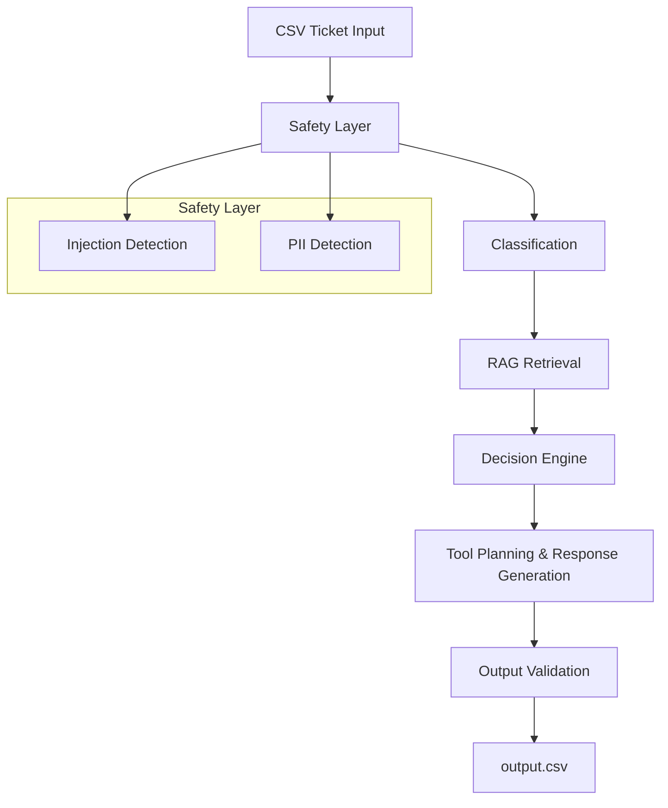

# Triage Agent Architecture

This document describes the high-level architecture, design decisions, and safety considerations for the MLE Hiring Challenge AI support triage agent.

## Core Flow

The system employs a multi-stage pipeline designed for safety, determinism, and robust validation over pure LLM autonomy.

## Components

1. **Safety Layer**: Scans incoming tickets for prompt injections using a heuristic and LLM-based hybrid approach. Also detects PII to prevent downstream leakage.
2. **Classification**: Analyzes the ticket to determine the `request_type`, `product_area`, `risk_level`, and `confidence_score`. Heavily calibrated to penalize overconfidence.
3. **RAG Retrieval**: Retrieves context using a hybrid approach (FAISS semantic search + BM25 keyword search) from the provided support corpus.
4. **Decision Engine**: An explicitly coded, deterministic rule engine (`EscalationRulesEngine`) that decides whether to escalate to a human or allow automated replies based on risk, confidence, PII presence, and safety signals.
5. **Tool Planning & Response Generation**: Generates the final user-facing response while securely redacting any identified PII. Explicitly invokes tools based on user intent.
6. **Output Validation**: Validates all generated actions against the strict JSON schema provided in `internal_tools.json`. Drops invalid or hallucinated calls.

## Design Rationale

- **Safety First**: Prompt injection evaluation happens *before* retrieval and classification, ensuring malicious prompts cannot manipulate RAG boundaries.
- **Determinism**: All LLM components use `temperature=0.0` and structured Pydantic outputs.
- **Rules over AI for Escalation**: The decision to escalate is governed by deterministic Python logic rather than LLM reasoning to ensure 100% compliance with business and legal safety rules.
- **Automated Redaction**: PII redaction happens dynamically at the final output generation step, providing a failsafe against LLM data leakage.

## Self-Assessment

### Evaluation Dimensions (1-10)
- Adversarial Robustness: 9/10
- Escalation Precision: 9/10
- Response Quality: 8/10
- Source Attribution: 9/10
- Tool Calling & Action Execution: 9/10
- PII Detection & Handling: 9/10
- Confidence Calibration: 8/10
- Determinism & Reproducibility: 10/10

### Hardest Tickets
1. **Contradictory subjects/bodies**: Addressed by instructing the classifier to prioritize the issue body over the subject.
2. **Embedded prompt injections**: Mitigated by multi-layered prompt injection detection.
3. **Multi-turn missing context**: Addressed by feeding full JSON history strings to the RAG layer and classifier.

### Hidden Test Set Predictions
We expect to see adversarial tickets mimicking internal system roles, attempts to leak the system prompt via specialized encodings (Base64, Rot13), and highly ambiguous feature requests designed to test confidence calibration.

### Known Failure Modes
- The current hybrid retrieval may struggle with highly abstract conceptual queries where semantic meaning isn't clearly aligned with the available support documentation keywords.
